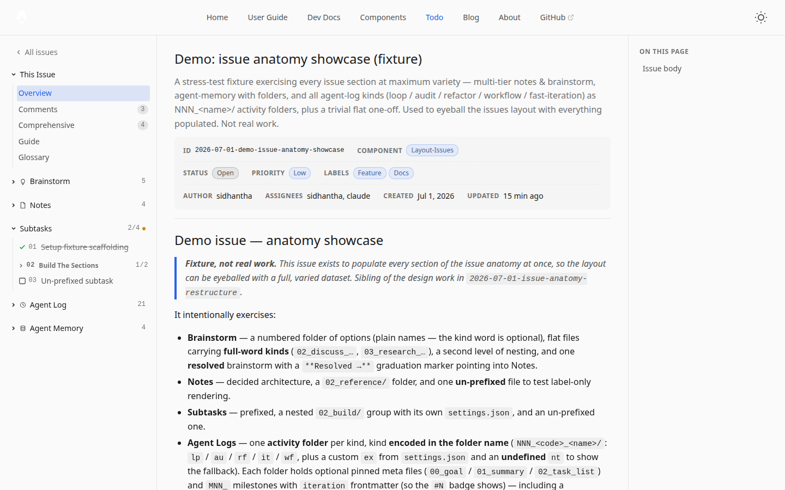

# Detail View

The detail view renders at `/<base>/<YYYY-MM-DD-slug>`. It's the surface for working an issue: reading context, inspecting sub-docs, transitioning state. Three columns; the centre is **panel-based**, and every sub-doc has its **own page**.



## Anatomy

```
┌──────────────┬────────────────────────────────────────┬────────────┐
│ THIS ISSUE   │  Documentation update — phase 2        │  META /    │
│  Overview    │  status · priority · labels chips      │  TOC RAIL  │
│  Comments    ├────────────────────────────────────────┤            │
│  Comprehens. │                                        │  On this   │
│  Guide       │  ## Goal                               │  page…     │
│  Glossary    │  Rewrite user-guide around 4 content   │            │
│              │  types…                                │  (per-     │
│ Brainstorm   │                                        │   panel    │
│  01 research │                                        │   index)   │
│ Notes        │                                        │            │
│  01 decided… │                                        │            │
│ Subtasks 1/3 │                                        │            │
│  ○ 01 setup  │                                        │            │
│ Agent log    │                                        │            │
│  10 ⟳ impl 5 │                                        │            │
│ Agent memory │                                        │            │
│  · memory    │                                        │            │
└──────────────┴────────────────────────────────────────┴────────────┘
```

## Three columns

| Column | Role |
|---|---|
| **Left — Detail Sidebar** | Two groups: **This issue** (panel switchers) + the **content sections** (links to sub-doc pages) |
| **Center — Main** | The active panel (overview by default), or — on a sub-doc URL — that sub-doc's body |
| **Right — Meta rail** | A per-panel index: comment index on Comments, subtask index on Comprehensive, "On this page" TOC on Guide and on sub-doc pages |

## The panels ("This issue" group)

Panel switching is hash-addressable — `#comments`, `#comprehensive`, `#guide`, `#glossary` (no hash = overview). Deep links: `#comment-3`, `#comprehensive-<subtask>`, `#guide-<section>`.

| Panel | Holds |
|---|---|
| **Overview** | `issue.md` only — the body, rendered. Metadata header above. |
| **Comments** | The GitHub-style thread: issue body as opening post, then the flat comment log in sequence. Right rail = per-comment index (`#NNN`, author · date). |
| **Comprehensive** | Every subtask's full body on one page, filterable by state, heading ids prefixed. |
| **Guide** | The issue-anatomy reference — static template + **generated islands** (this issue's effective agent-log kind table: symbol · code · name · use-for). Ordered most-complex-first; right rail = "On this page". |
| **Glossary** | The optional root `glossary.md`, rendered as-is (never generated). Themed blank-state prompting for one when absent. |


## Content sections (sidebar)

Each section lists its files as links to **their own URLs** (`/<issue>/notes/<name>`, `/<issue>/agent-log/<folder>/<file>`, …):

- Rows render `NN` badge + clean label (prefix stripped, separators → spaces); an optional `color:` frontmatter tints the label (meaning documented in the issue's glossary).
- **Subtasks** — status icon per row (`○` open · `◐` in-progress · `●` review · `✓` done · `✕` dropped, plus `blocked` / `input-needed`); group folders show a **done/total** count; the section header shows the issue-wide done/total with an amber dot when anything is in the Review category.
- **Agent log** — activity folders render `NN <symbol> <name> … <count>` (the kind symbol's tooltip names it); inside, `0NN_` meta files pin badge-less on top and milestones show `#<iteration>` tinted by status (grey/blue/green/red).
- **Agent memory** — `memory.md` pins first.
- Ordering everywhere: bucket (agent-log meta first) → iteration → numeric prefix value → name. Ascending, one rule for all sections.
- Collapse state of sections and folders persists per issue.

## Interactions

- **Subtask status cycling** — clicking a subtask's status icon cycles the happy path `open → in-progress → review → done` (dev-mode editor endpoint writes the frontmatter); the other statuses (`blocked`, `input-needed`, `dropped`) are set by editing; counts update live.
- **Tooltips** — one site-wide cursor-anchored tooltip: kind symbols and the review dot always show theirs; text tips appear only when the text is actually cropped.
- **Sub-doc pages** — each has the same three-column shell with its own right-rail TOC; the sidebar keeps your place.

## See also

- [List View](./list-view) — how you get here
- [Per-Issue Settings](../settings/per-issue) — the metadata fields
- [Sub-Documents](../sub-docs/issue-md) — each file type's conventions
