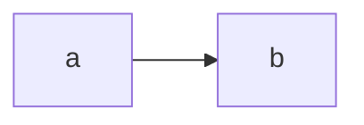

# Writing markdown content — reference

Cross-cutting rules for writing markdown content across content types (docs, blog, custom pages). For writing *inside the issue tracker*, the `agent-ks-issues` skill carries its own self-contained writing reference.

**Canonical source of truth:** the framework's bundled `@root/default-docs/data/user-guide/15_writing-content/` — read those pages when this reference is unclear.

> **Sync note:** the mechanics sections here (callouts & collapsibles, assets, `[[path]]` embedding, code blocks) are mirrored in the `agent-ks-issues` skill's `references/10_writing/10_writing.md` — when editing one, mirror the other.

> **Status:** stub. The detailed spec is being authored under `2025-06-25-claude-skills/subtasks/03_writing-skill.md`. For now, this file captures the essentials.

---

## Universal rules

- **Frontmatter `title` is required** on every `.md` file. Builds fail without it.
- **Description** is optional but recommended (used in meta tags + sidebar tooltips).
- **`draft: true`** hides the page from the production build. Works on docs, blog, issues.
- **Don't write MDX** — this project uses pure markdown (`.md`); rich content comes from native GFM extensions (alert callouts, `<details>`, fenced diagrams), not MDX components.

## Standard frontmatter

```yaml
---
title: "Page title"
description: "1-2 sentence summary used in <meta> + sidebar tooltips."
draft: false
---
```

Per-content-type extras:
- **docs** — `sidebar_label`, `sidebar_position`
- **blog** — `date` (YYYY-MM-DD), `author`, `tags`
- **issues** — different schema (metadata in `settings.json`, per-subdoc frontmatter): see the `agent-ks-issues` skill.

## Rich content — native markdown

Everything rich is plain markdown — GFM plus a couple of native HTML/fence extensions. No project-specific tag syntax.

**Callouts** — GFM alert blockquotes, five types: `NOTE`, `TIP`, `IMPORTANT`, `WARNING`, `CAUTION`.

```markdown
> [!NOTE]
> Body of the callout. Nest normal markdown inside; the type sets the color + icon.
```

**Collapsible content** — native `<details>` / `<summary>`:

```markdown
<details>
<summary>Click to expand</summary>

Hidden content — markdown inside renders normally.

</details>
```

**Diagrams** — fenced `mermaid` / `graphviz` blocks render in place:

````markdown

````

Keep diagram source in its own `.mmd` / `.dot` file and embed it inside the fence — see "Content embedding (`[[path]]`)" below.

**Excalidraw** — image syntax embeds a scene read-only (fetched by reference, rendered as SVG client-side); a plain link deliberately stays a link to the raw file:

```markdown
   ← embeds; alt = caption, click opens the pan/zoom viewer, caption links to the file
[Architecture](./assets/arch.excalidraw)    ← plain link, opens the raw scene
```

Never inline scene JSON — the `.excalidraw` file stays the single source of truth. A missing file fails the build (`asset-missing`); a malformed scene shows an error box in place. Dark mode inverts automatically.

## Asset embedding

Two ways to reference images and downloadable files:

- **Shared files** live under the project's root `assets/` folder, served from `/assets/` — reference with absolute paths:
  ```markdown
  
  [Download the spec](/assets/specs/api-v1.pdf)
  ```
- **Colocated files** sit next to the markdown that uses them (`./assets/flow.png`) — reference with a **relative** path. Works in docs, blog, and issues; the build rewrites the relative `` **and relative `<a href>` links to colocated non-page files** (`[Spec](./assets/api.pdf)`) to `/content-assets/<path-relative-to-the-content-root>` (shared `asset-src` postprocessor + `/content-assets/[...path]` route). Colocated non-markdown files are never indexed into the sidebar.
  ```markdown
  
  ```

For embedding a file's **raw text content** (not images), see the next section.

## Content embedding (`[[path]]`)

`[[path]]` inlines another file's **raw text content** at build time — the pattern is replaced with the file's bytes *before* the markdown renders. It's for code, text, and diagram source — **never images** (use `` for those). Works the same in **all three content types** — docs, blog, and issues (each runs the asset-embed preprocessor); only path resolution differs (see below).

The power move: wrap it in a fenced block so the embedded content is treated as that language. The file stays the single source of truth; the docs always show its current contents.

**Embed a code file** (syntax-highlighted):

````markdown
```python
[[./assets/example.py]]
```
````

**Embed diagram source** — Mermaid / Graphviz blocks render from the embedded file, so the diagram lives in its own `.mmd` / `.dot` file:

````markdown
```mermaid
[[./assets/flow.mmd]]
```

```graphviz
[[./assets/graph.dot]]
```
````

**Embed inside a collapsible** (native `<details>`):

````markdown
<details>
<summary>example.py</summary>

```python
[[./assets/example.py]]
```

</details>
````

Path resolution differs per content type — docs: relative to the file (`./assets/x.py`); blog: `assets/<post-slug>/<name>`; issues: relative to the file, bare name → `<same-folder>/assets/<name>`. **Inside a fenced block the path must be file-relative — start it with `./` or `../`**; bare names are deliberately skipped there so documentation examples don't expand (e.g. from an issue note in `notes/`, `[[../assets/flow.mmd]]` reaches the issue-root `assets/`). Escape with `\[[...]]` to render the brackets literally. Full rules + per-type examples: `@root/default-docs/data/user-guide/15_writing-content/03_asset-embedding.md`.

## Code blocks

Triple-backtick with language tag for syntax highlighting:

````markdown
```typescript
const x: number = 42;
```
````

For long blocks, wrap the fence in a native `<details>` (see "Rich content — native markdown").

## Cross-content-type concerns

- **Drafts** — `draft: true` works on every type
- **Dev-only content** — see `@root/default-docs/data/user-guide/10_configuration/06_dev-mode.md`
- **`NN_` prefix** — used in docs/dev-docs folders (NOT in blog; optional-and-looser in the tracker — see the `agent-ks-issues` skill)

## Cross-references

- `@root/default-docs/data/user-guide/15_writing-content/` (the framework's bundled user-guide) — full section
- `references/layouts/docs-layout.md` — docs-specific structure / settings
- `references/layouts/blog-layout.md` — blog-specific naming / frontmatter
- the `agent-ks-issues` skill — issue-specific structure + tracker writing
