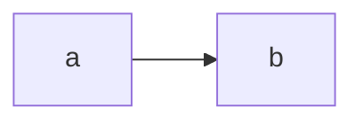

# Writing markdown content — reference

Cross-cutting rules for writing markdown content across content types (docs, blog, custom pages). For writing *inside the issue tracker*, the `agent-ks-issues` skill carries its own self-contained writing reference.

**Canonical source of truth:** the framework's bundled `@root/default-docs/data/user-guide/15_writing-content/` — read those pages when this reference is unclear.

> **Sync note:** the mechanics sections here (callouts & collapsibles, assets, `[[path]]` embedding, code blocks) are mirrored in the `agent-ks-issues` skill's `references/10_writing/10_writing.md` — when editing one, mirror the other.

> **Status:** stub. The detailed spec is being authored under `2025-06-25-claude-skills/subtasks/03_writing-skill.md`. For now, this file captures the essentials.

---

## Universal rules

- **Frontmatter `title` is required** on every `.md` file. Builds fail without it.
- **Description** is optional but recommended (used in meta tags + sidebar tooltips).
- **`draft: true`** hides the page from the production build. Works on docs, blog, issues.
- **Don't write MDX** — this project uses pure markdown (`.md`); rich content comes from native GFM extensions (alert callouts, `<details>`, fenced diagrams), not MDX components.
- **Every reference to a file in this project is a relative markdown link** — `./x`, `../x`, pointing at the **source file** (`../25_themes/03_variables.md`), never at its published URL. **The reason is what these documents are:** they are written filesystem-first, so that filesystem tools work on them — `agent-ks move`, `grep`, an editor, an agent walking the tree. A relative link is the only form that is **true on disk**, so it is the only form all of those can follow; the rendered site is one consumer of the files, not the thing being built. A site-absolute `/…` link is a URL rather than a path — it renders fine and `agent-ks move` skips it, so it leaves link maintenance silently and rots on the next file move. If a relative link 404s on the site, that is a renderer defect to file, never a reason to rewrite the content. **There is no exception, not even for assets** — an image or a PDF a page uses is colocated and referenced relatively too (see *Asset embedding* below); `/assets/…` belongs to the site chrome and is named from code, never from a document. Full rule: [Cross-linking between docs pages](./layouts/docs-layout.md).
- **And it has to be a LINK, not a backticked path.** `` `../25_themes/03_variables.md` `` quoted in prose is a string that looks like a reference: `agent-ks move` cannot rewrite it, a reader cannot click it, and an agent has to search to resolve it — all silently. The exception is a target that is **not a document** (source code, config, a binary), which has nothing to link to, so `` `src/loaders/paths.ts` `` is correct.
- **Find one while editing a file? Convert it there and then** — take the link text from the target's own `title` frontmatter, so the sentence gains a name instead of a path. **This is not a tracked sweep.** If you are asked for one, run it as *detect → check → convert*: collect backticked paths, keep only those that **resolve to a real document on disk** (that test is what separates a reference from a filename being discussed as a value), convert those, then re-run `agent-ks check link-form` and the issues gate. Delegate it if it is large.

## Standard frontmatter

```yaml
---
title: "Page title"
description: "1-2 sentence summary used in <meta> + sidebar tooltips."
draft: false
---
```

Per-content-type extras:
- **docs** — `sidebar_label`, `sidebar_position`
- **blog** — `date` (YYYY-MM-DD), `author`, `tags`
- **issues** — different schema (metadata in `settings.json`, per-subdoc frontmatter): see the `agent-ks-issues` skill.

## Rich content — native markdown

Everything rich is plain markdown — GFM plus a couple of native HTML/fence extensions. No project-specific tag syntax.

**Callouts** — GFM alert blockquotes, five types: `NOTE`, `TIP`, `IMPORTANT`, `WARNING`, `CAUTION`.

```markdown
> [!NOTE]
> Body of the callout. Nest normal markdown inside; the type sets the color + icon.
```

**Collapsible content** — native `<details>` / `<summary>`:

```markdown
<details>
<summary>Click to expand</summary>

Hidden content — markdown inside renders normally.

</details>
```

**Diagrams** — fenced `mermaid` / `graphviz` blocks render in place:

````markdown

```mermaid
flowchart LR
  a --> b
```
````

Keep diagram source in its own `.mmd` / `.dot` file and embed it inside the fence — see "Content embedding (`[[path]]`)" below.

**Excalidraw and draw.io** — image syntax embeds the file read-only (fetched by reference, rendered as SVG client-side); a plain link deliberately stays a link to the raw file:

```markdown
   ← embeds; alt = caption, click opens the pan/zoom viewer, caption links to the file
       ← same syntax, same behaviour
[Architecture](./assets/arch.excalidraw)    ← plain link, opens the raw file
```

Never inline scene JSON or mxGraph XML — the file stays the single source of truth. A missing file fails the build (`asset-missing`); a malformed one shows an error box in place.

**Dark mode differs between the two, and it changes how you author.** Mermaid, Graphviz and Excalidraw are colour-inverted, so any colour is flipped for you. draw.io is **not** — its viewer resolves a real dark palette instead, because these files carry raster icons and screenshots that a filter turns into negatives, and because the dark version then lives in the SVG rather than over it. Author-set colours are re-resolved for a dark canvas (light green → darker green), not left untouched. So in a `.drawio`, **pick colours whose meaning survives on both canvases**; uncoloured shapes take care of themselves. Prefer saving uncompressed (*File → Properties → Compressed: off*) so the file diffs and greps like the rest of the content. draw.io's stencil icon sets (AWS/Azure/GCP/Cisco) are not bundled — a diagram using them renders fallback shapes; stick to the built-in palette, or install stencils into `assets/drawio/stencils/`.

## Asset embedding

**One way, and it is relative. A document never references the site assets folder.**

Everything a page uses — images, diagrams, PDFs, data — goes in an `assets/` folder **beside that page**, at any depth, and is referenced relatively:

```markdown

[Spec](./assets/api-v1.pdf)

```

The build rewrites the relative `` **and relative `<a href>` links to colocated non-page files** to `/content-assets/<path-relative-to-the-content-root>` (shared `asset-src` postprocessor + `/content-assets/[...path]` route). Colocated non-markdown files are never indexed into the sidebar. This works in docs, blog and issues alike.

**Why there is no second option.** The asset belongs next to the document that uses it: it moves with the page, it is readable from the file tree, and it is *true on disk* — the same reason every link is relative. A site with hundreds of pages must not funnel every image into one directory, and a document that points at `/assets/…` has written a URL instead of a path, which stops being true the moment the file is read outside the site.

> **`/assets/…` is the framework's, not yours.** `default-docs/assets/` holds what the *site chrome* needs — favicon, logos, standard symbols loaded by layouts and config. It is referenced from **code**, never from a document body. If you are writing markdown, you have no reason to name it. `agent-ks check link-form` enforces this: it rejects every site-absolute target in content, and that strictness is deliberate — **do not make the rule looser to accommodate an asset.** Colocate it instead.

For embedding a file's **raw text content** (not images), see the next section.

## Content embedding (`[[path]]`)

`[[path]]` inlines another file's **raw text content** at build time — the pattern is replaced with the file's bytes *before* the markdown renders. It's for code, text, and diagram source — **never images** (use `` for those). Works the same in **all three content types** — docs, blog, and issues (each runs the asset-embed preprocessor); only path resolution differs (see below).

The power move: wrap it in a fenced block so the embedded content is treated as that language. The file stays the single source of truth; the docs always show its current contents.

**Embed a code file** (syntax-highlighted):

````markdown
```python
[[./assets/example.py]]
```
````

**Embed diagram source** — Mermaid / Graphviz blocks render from the embedded file, so the diagram lives in its own `.mmd` / `.dot` file:

````markdown
```mermaid
[[./assets/flow.mmd]]
```

```graphviz
[[./assets/graph.dot]]
```
````

**Embed inside a collapsible** (native `<details>`):

````markdown
<details>
<summary>example.py</summary>

```python
[[./assets/example.py]]
```

</details>
````

Path resolution differs per content type — docs: relative to the file (`./assets/x.py`); blog: `assets/<post-slug>/<name>`; issues: relative to the file, bare name → `<same-folder>/assets/<name>`. **Inside a fenced block the path must be file-relative — start it with `./` or `../`**; bare names are deliberately skipped there so documentation examples don't expand (e.g. from an issue note in `notes/`, `[[../assets/flow.mmd]]` reaches the issue-root `assets/`). Escape with `\[[...]]` to render the brackets literally. Full rules + per-type examples: `@root/default-docs/data/user-guide/15_writing-content/03_asset-embedding.md`.

## Code blocks

Triple-backtick with language tag for syntax highlighting:

````markdown
```typescript
const x: number = 42;
```
````

For long blocks, wrap the fence in a native `<details>` (see "Rich content — native markdown").

## Cross-content-type concerns

- **Drafts** — `draft: true` works on every type
- **Dev-only content** — see `@root/default-docs/data/user-guide/10_configuration/06_dev-mode.md`
- **`NN_` prefix** — used in docs/dev-docs folders (NOT in blog; optional-and-looser in the tracker — see the `agent-ks-issues` skill)

## Cross-references

- `@root/default-docs/data/user-guide/15_writing-content/` (the framework's bundled user-guide) — full section
- `references/layouts/docs-layout.md` — docs-specific structure / settings
- `references/layouts/blog-layout.md` — blog-specific naming / frontmatter
- the `agent-ks-issues` skill — issue-specific structure + tracker writing
