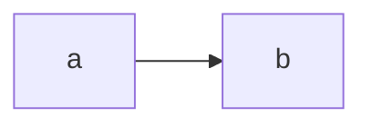

# Writing markdown content — reference

Rules for writing markdown in any content type: docs, blog, custom pages, and the issue tracker. This file is the **one home** for the linking rule and for the markdown mechanics (callouts, diagrams, assets, embedding). The `agent-ks-issues` skill's `10_writing.md` links here and adds only what is tracker-specific.

**Canonical source of truth:** the framework's bundled `@root/default-docs/data/user-guide/15_writing-content/` — read those pages when this reference is unclear.

---

## Universal rules

- **Frontmatter `title`** on every `.md` file. Docs and blog builds fail without it. The tracker falls back to the slug, so a titleless tracker file ships with an ugly heading and no error.
- **`description`** is optional but recommended (meta tags + sidebar tooltips).
- **`draft: true`** hides the page from the production build. Works on docs, blog, issues.
- **Don't write MDX.** Pure markdown (`.md`); rich content comes from native GFM extensions (alert callouts, `<details>`, fenced diagrams), not components.

## Standard frontmatter

```yaml
---
title: "Page title"
description: "1-2 sentence summary used in <meta> + sidebar tooltips."
draft: false
---
```

Per-content-type extras:
- **docs** — `sidebar_label`, `sidebar_position`
- **blog** — `date` (YYYY-MM-DD), `author`, `tags`, `featured`
- **issues** — metadata in `settings.json`, per-subdoc frontmatter: see the `agent-ks-issues` skill.

## Linking

**Every reference to a file in this project is a relative markdown link, and the link text says what the target is.**

```markdown
See [how aliases resolve](../05_getting-started/03_aliases.md) for setup.
```

| Form | Means | Use for |
|---|---|---|
| `./x` · `../x` | relative to **this file's own directory** | every reference to a file inside this project — pages, images, PDFs, data — including across sections |
| `/x` | site-absolute, a URL from the site root | **nothing.** It is a URL, not a path, and it stops being true the moment the file is read outside the site |
| `https://…` | external | services and pages outside this project |

**Why.** These documents are filesystem-first. `agent-ks move`, `grep`, an editor, Obsidian and an agent walking the tree all read the files on disk. A relative link is the only form that is **true on disk**, so it is the only form all of those can follow. The rendered site is one consumer of the files, not the thing being built. Mechanically: `agent-ks move` rewrites a link by resolving it to a real file, so it skips every link starting with `/`. A site-absolute link renders fine and has left link maintenance for good.

**Write the source path, not the URL.** Link `../25_themes/03_variables.md`, not the published slug. The renderer strips `NN_` prefixes and the `.md` extension and accepts both spellings.

**Assets are not an exception.** A page's images and downloads sit in an `assets/` folder beside it and are linked relatively (see *Asset embedding* below). `/assets/…` is the framework's own route, named from layout and config code, never from a document body. So: if you are writing markdown, a leading `/` is wrong.

**A link, never a backticked path.** `` `../25_themes/03_variables.md` `` quoted in prose is a string that looks like a reference. It costs three things, all silent: `move` cannot rewrite it, a reader cannot click it, and an agent has to search to resolve it. A link whose text is only a number, `[03](./03_thing.md)`, is still a number. The text must name the thing.

**The one exception: a target that is not a document.** Source code, config, a binary, a directory. There is nothing to link to, so `` `src/loaders/paths.ts` `` is correct. The same applies to a path discussed as a *value* rather than pointed at. "Not served on the site" is not the test — the skill files under `plugins/agent-ks/skills/` never render and still link each other relatively.

**Find a backticked document path while editing? Convert it there and then.** Take the link text from the target's own `title`. This is not a tracked sweep. If asked for one, run it as *detect → check → convert*: collect backticked paths, keep only those that resolve to a real document on disk, convert those, then re-run `agent-ks check link-form` and the issues gate.

> [!WARNING]
> If a relative link 404s on the built site, that is a **renderer** bug. Do not "fix" it by converting to `/`. File the defect instead. See `astro-doc-code/src/parsers/postprocessors/internal-links.ts`.

### The ordering label — keeping the number too

The sidebar lists entries by number, so a link that carries the number can be matched against what a reader already sees. Open the link text with the target's **ordering path** — the numeric prefixes of its folders and of its own name, joined by `/` — then the name:

```markdown
[19/04/02 the vocabulary page](../19_issues/04_setup/02_vocabulary.md)
[040/100 the migration script](../../subtasks/040_execution/100_migration-script.md)
[020/02/090 the summary-shape round](./02_working/090_summary-shape-and-links.md)
```

| | |
|---|---|
| **Optional** | A plain descriptive link is never wrong. The label adds navigation; the name still has to be there |
| **Derived, never invented** | Walk up from the file collecting numeric prefixes; stop at the first segment without one. `subtasks/040_execution/100_x.md` → `040/100`. A target with no prefix takes no label |
| **`agent-ks move` keeps it current** | It recomputes the label whenever it rewrites the target |
| **The validator warns on drift** | `agent-ks check issues` warns on a label that disagrees with its target. A stale label still resolves, so nothing else looks wrong |

## Rich content — native markdown

**Callouts** — GFM alert blockquotes, five types: `NOTE`, `TIP`, `IMPORTANT`, `WARNING`, `CAUTION`.

```markdown
> [!NOTE]
> Body of the callout. Nest normal markdown inside; the type sets the color + icon.
```

**Collapsible content** — native `<details>` / `<summary>`:

```markdown
<details>
<summary>Click to expand</summary>

Hidden content — markdown inside renders normally.

</details>
```

**Diagrams** — fenced `mermaid` / `graphviz` blocks render in place:

````markdown

```mermaid
flowchart LR
  a --> b
```
````

Keep diagram source in its own `.mmd` / `.dot` file and embed it inside the fence — see *Content embedding* below.

**Excalidraw and draw.io** — image syntax embeds the file read-only (fetched by reference, rendered as SVG client-side); a plain link stays a link to the raw file:

```markdown
   ← embeds; alt = caption, click opens the pan/zoom viewer
       ← same syntax, same behaviour
[Architecture](./assets/arch.excalidraw)    ← plain link, opens the raw file
```

Never inline scene JSON or mxGraph XML — the file stays the single source of truth. A missing file fails the build (`asset-missing`); a malformed one shows an error box in place.

**Dark mode differs between the two.** Mermaid, Graphviz and Excalidraw are colour-inverted. draw.io is not: its viewer resolves a real dark palette, because `.drawio` files carry raster icons and screenshots that a filter turns into negatives. Author-set colours are re-resolved for a dark canvas, so pick colours whose meaning survives on both. Save uncompressed (*File → Properties → Compressed: off*) so the file diffs and greps. draw.io stencil sets (AWS/Azure/GCP/Cisco) are not bundled; stick to the built-in palette or install stencils into `assets/drawio/stencils/`.

## Asset embedding

**One way, and it is relative. A document never references the site assets folder.**

Everything a page uses — images, diagrams, PDFs, data — goes in an `assets/` folder **beside that page**, at any depth, and is referenced relatively:

```markdown

[Spec](./assets/api-v1.pdf)

```

The build rewrites relative `` and relative `<a href>` links to colocated non-page files to `/content-assets/<path-relative-to-the-content-root>`. Colocated non-markdown files are never indexed into the sidebar. This works in docs, blog and issues alike. Blog files are flat, so a post's assets live in `assets/<post-slug>/` beside them.

`agent-ks check link-form` rejects every site-absolute target in content. That strictness is deliberate: **do not loosen the rule to fit an asset. Colocate it instead.**

**Never commit a raw screenshot.** Run `agent-ks img` on any image you add so figures stay ≈ 60–100 KB. See [images.md](./images.md).

## Content embedding (`[[path]]`)

`[[path]]` inlines another file's **raw text** at build time — code, text, diagram source, never images. Wrap it in a fenced block so the content is treated as that language. Works in docs, blog and issues.

````markdown
```python
[[./assets/example.py]]
```

```mermaid
[[./assets/flow.mmd]]
```
````

Path resolution per content type — docs: relative to the file; blog: `assets/<post-slug>/<name>`; issues: relative to the file, bare name → `assets/` next to that file. **Inside a fenced block the path must start with `./` or `../`**; bare names are skipped there so documentation examples do not expand. Escape with `\[[...]]` to render the brackets literally. Full rules: `@root/default-docs/data/user-guide/15_writing-content/03_asset-embedding.md`.

## Code blocks

Triple-backtick with a language tag. For long blocks, wrap the fence in a native `<details>`.

## Cross-references

- `@root/default-docs/data/user-guide/15_writing-content/` — the framework's bundled user-guide, full section
- [docs-layout.md](./layouts/docs-layout.md) — docs-specific structure and settings
- [blog-layout.md](./layouts/blog-layout.md) — blog naming and frontmatter
- the `agent-ks-issues` skill — tracker structure and tracker-specific writing rules
